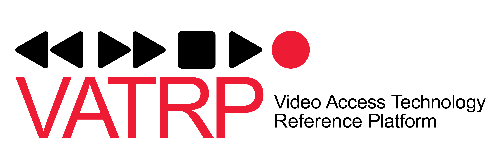

# VATRP 

### Role

The Video Access Technology Reference Platform (VATRP), formerly known as the ACE APP, is a Windows desktop application that can perform video relay services (VRS) for the community of deaf and hard of hearing individuals. VRS is a form of Telecommunications Relay Service (TRS) that enables people who are deaf or hard of hearing and use sign language, such as American Sign Language (ASL), to communicate with voice telephone users through video equipment. These services also enable communication between such individuals directly in suitable modalities, including any combination of sign language via video, real-time text (RTT), and speech.

Today, the Federal Communications Commission (FCC) utilizes the VATRP as a functional test tool for assessing and ensuring interoperability between VRS providers. In summary, the VATRP provides the following distinctive value:

* Test tool to accurately assess and test for (Relay User Equipment) RUE specification compliance among VRS provider services and devices.
* Test tool to accurately assess and test interoperability among VRS provider services and devices.
* Troubleshooting tool for the VRS providers to identify, validate, and resolve intra and inter-operability and RUE specification compliance issues.

### Additional Information
For more information about the VATRP, please refer to the VATRP Platform Release Documentation included in this repository. The documentation contains release notes, an installation guide, a user guide, and a test plan.
